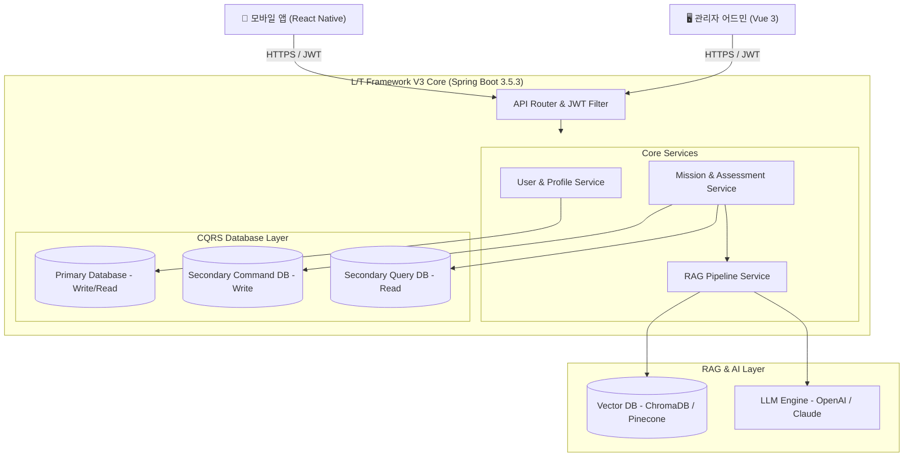
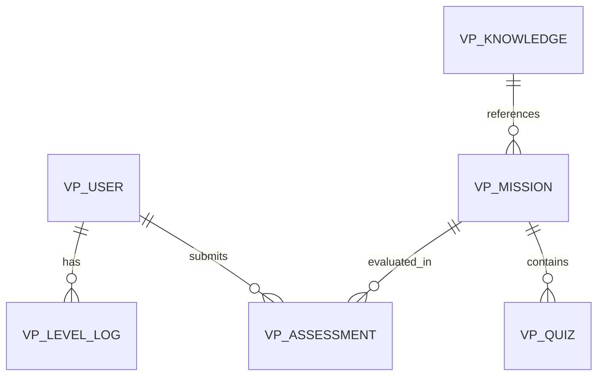
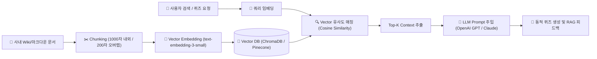
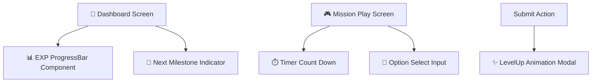

# 💻 MVP 시스템 아키텍처 및 상세 기술 명세서 (Technical Specification)

본 기술 명세서는 내부 지식을 활용한 백엔드/프론트엔드 직무 게이미피케이션 플랫폼의 MVP 구현을 위해 작성되었습니다. 본 명세서는 기존에 구축된 **L/T Framework V3** 아키텍처 사상과 연동 및 확장 가능한 구조로 설계되었습니다.

---

## 📄 1. 시스템 아키텍처 (Architecture Diagrams)

### 1.1 개념적 아키텍처 (Conceptual Architecture)
전체 시스템은 모바일 서비스(React Native)와 백오피스 어드민(Vue 3)이 Spring Boot 기반의 통합 API 서버를 통해 통신하며, RAG 엔진을 거쳐 사내 지식 베이스를 연동하는 구조입니다.



### 1.2 물리적 데이터 흐름 (Physical Data Flow)
1. **사용자 액션**: 퀴즈 및 미션 시작 요청 ➡️ `MissionService`가 RAG 기반으로 지식 벡터 DB에서 문맥 조회.
2. **컨텐츠 동적 생성**: Vector DB에서 코사인 유사도가 가장 높은 문서를 검색 ➡️ 프롬프트 구성 후 LLM API 호출 ➡️ 동적 퀴즈/시나리오 JSON 파싱 후 응답.
3. **이력 및 점수화**: 제출된 답안은 `SecCommandDB`에 저장되며, 감사(Audit) 필드는 MyBatis Interceptor를 통해 자동 주입.

---

## 💾 2. 백엔드 아키텍처 설계 (L/T Framework V3 연계)

백엔드는 `admin-module` (Java Library) 및 `admin-work-api` (Executable Spring Boot App) 프로젝트 구조를 따르며, 다음과 같은 핵심 설계를 채택합니다.

### 2.1 CQRS 멀티 데이터소스 분리
MyBatis 3.0.3 매핑 규칙에 따라 Command(쓰기)와 Query(읽기)의 트랜잭션 및 데이터소스를 분리합니다.
- **Primary Data Source**: 사용자 계정, 프로필 및 레벨 시스템 관리.
- **Secondary Command Data Source (`com.valuesplay.project.mission.mapper.command`)**: 퀴즈 제출, 평가 완료, 이력 적재 등 CUD 작업.
- **Secondary Query Data Source (`com.valuesplay.project.mission.mapper.query`)**: 미션 리스트 조회, 지식 문서 및 점수 결과 조회.

### 2.2 JWT & Redis 기반 인증 및 보안
- **`JwtAuthenticationTokenFilter`**: 헤더의 `Authorization: Bearer <JWT>` 검증 후 Redis 세션 또는 DB 세션(`vp_user_token`)을 통해 로그인 사용자를 실시간 복원 (`SecurityContextHolder` 주입).
- **데이터 권한 범위 (`@DataScope`)**: 직급 및 직무 범위에 맞춘 dynamic SQL 주입. MySQL의 경우 `FIND_IN_SET`, PostgreSQL의 경우 `LIKE` 연산자를 활용하여 부서별 미션 노출 범위를 필터링합니다.

### 2.3 예외 처리 및 공통 응답 구조
- 모든 비즈니스 예외는 `ServiceException`으로 래핑하여 던지고, `GlobalExceptionHandler`가 포착하여 공통 JSON 응답 형식(`AjaxResult`)으로 반환합니다.
- 클라이언트 타입이 모바일 앱일 경우, 비정상 API 오류 발생 시에도 HTTP status는 `200 OK`로 수신하고 Response Body 내부 `code`를 통해 상세 상태를 분기합니다.

```json
{
  "code": 200,
  "msg": "Success",
  "data": { ... }
}
```

---

## 💾 3. 데이터베이스 ERD 및 스키마 설계

### 3.1 개념적 ERD 관계



### 3.2 핵심 테이블 DDL (PostgreSQL/MySQL Hybrid 스펙)

#### 1. 사용자 프로필 테이블 (`vp_user`)
```sql
CREATE TABLE vp_user (
    user_id VARCHAR(50) NOT NULL COMMENT '사용자 ID (사번)',
    dept_id VARCHAR(50) NOT NULL COMMENT '소속 부서 ID',
    user_name VARCHAR(100) NOT NULL COMMENT '이름',
    user_level INT DEFAULT 1 COMMENT '현재 레벨',
    accumulated_exp BIGINT DEFAULT 0 COMMENT '누적 경험치',
    current_exp INT DEFAULT 0 COMMENT '현재 레벨 내 경험치',
    job_type VARCHAR(20) NOT NULL COMMENT '직무 구분 (BACKEND / FRONTEND)',
    create_by VARCHAR(50) DEFAULT 'system' COMMENT '생성자',
    create_time TIMESTAMP DEFAULT CURRENT_TIMESTAMP COMMENT '생성일시',
    update_by VARCHAR(50) DEFAULT 'system' COMMENT '수정자',
    update_time TIMESTAMP DEFAULT CURRENT_TIMESTAMP ON UPDATE CURRENT_TIMESTAMP COMMENT '수정일시',
    PRIMARY KEY (user_id)
);
```

#### 2. 미션 마스터 테이블 (`vp_mission`)
```sql
CREATE TABLE vp_mission (
    mission_id BIGINT AUTO_INCREMENT COMMENT '미션 ID',
    title VARCHAR(255) NOT NULL COMMENT '미션 제목',
    description TEXT COMMENT '미션 설명',
    mission_type VARCHAR(20) NOT NULL COMMENT '미션 타입 (QUIZ, SCENARIO, PRACTICE)',
    difficulty VARCHAR(10) NOT NULL COMMENT '난이도 (EASY, MEDIUM, HARD)',
    exp_reward INT DEFAULT 100 COMMENT '지급 경험치 보상',
    knowledge_id VARCHAR(100) COMMENT '사내 지식 문서 참조 ID',
    create_by VARCHAR(50) DEFAULT 'system',
    create_time TIMESTAMP DEFAULT CURRENT_TIMESTAMP,
    update_by VARCHAR(50) DEFAULT 'system',
    update_time TIMESTAMP DEFAULT CURRENT_TIMESTAMP ON UPDATE CURRENT_TIMESTAMP,
    PRIMARY KEY (mission_id)
);
```

#### 3. 퀴즈 문항 테이블 (`vp_quiz`)
```sql
CREATE TABLE vp_quiz (
    quiz_id BIGINT AUTO_INCREMENT COMMENT '퀴즈 ID',
    mission_id BIGINT NOT NULL COMMENT '미션 ID',
    question TEXT NOT NULL COMMENT '질문 내용',
    quiz_options JSON COMMENT '객관식 보기 목록 (JSON Array 형태)',
    correct_answer VARCHAR(255) NOT NULL COMMENT '정답',
    explanation TEXT COMMENT '오답 피드백 및 힌트 해설',
    create_by VARCHAR(50) DEFAULT 'system',
    create_time TIMESTAMP DEFAULT CURRENT_TIMESTAMP,
    PRIMARY KEY (quiz_id)
);
```

#### 4. 미션 평가 제출 이력 테이블 (`vp_assessment`)
```sql
CREATE TABLE vp_assessment (
    assessment_id BIGINT AUTO_INCREMENT COMMENT '평가 ID',
    user_id VARCHAR(50) NOT NULL COMMENT '제출자 ID',
    mission_id BIGINT NOT NULL COMMENT '수행 미션 ID',
    submitted_answers JSON NOT NULL COMMENT '사용자 제출 답안 데이터',
    score INT NOT NULL COMMENT '평가 점수 (0-100)',
    pass_yn CHAR(1) DEFAULT 'N' COMMENT '합격 여부 (Y/N)',
    earned_exp INT DEFAULT 0 COMMENT '획득 경험치',
    create_by VARCHAR(50),
    create_time TIMESTAMP DEFAULT CURRENT_TIMESTAMP,
    PRIMARY KEY (assessment_id)
);
```

---

## ⚙️ 4. RAG Pipeline 및 Vector DB 설계

RAG(Retrieval-Augmented Generation) 파이프라인은 사내 기술 위키, 장애 극복기, API 규격서 등 내부 문서를 지속적으로 수집하여 미션 퀴즈 및 AI 대화형 탐색에 활용합니다.



### 4.1 RAG 구성 정보 및 파라미터
- **Chunking Strategy**: Markdown 파서를 통한 헤더 기반 슬라이싱. 평균 800~1000 tokens 분할, 문맥 손실 방지를 위한 200 tokens Overlap 설정.
- **Embedding Model**: OpenAI `text-embedding-3-small` (1536 Dimensions) 또는 로컬 경량 모델(bge-m3).
- **Retrieval Metric**: Cosine Similarity, 임계점(Threshold) `0.72` 이상의 청크에 대해서만 LLM Context로 전달.
- **Prompt Framework**: LangChain / Spring AI를 통해 System Context에 "사내 가이드 및 기술 정책을 기반으로만 객관식 퀴즈 1문항을 JSON 포맷으로 생성하라"는 프롬프트를 바인딩.

---

## 🌐 5. 상세 API 명세서 (API Specs)

### 5.1 [GET] /api/v1/mission/{id}/quiz
미션 진입 시, 해당 미션의 상세 퀴즈(객관식/시나리오 분기) 리스트를 획득합니다. RAG를 활용한 동적 생성의 경우, 백엔드에서 런타임에 LLM을 거쳐 JSON을 캐싱합니다.

- **Request Headers**:
  - `Authorization: Bearer jwt_token_string`
- **Path Variables**:
  - `id` (Long): 미션 고유 ID
- **Response (200 OK)**:
```json
{
  "code": 200,
  "msg": "Success",
  "data": {
    "missionId": 105,
    "title": "Spring Boot 멀티 데이터소스 CQRS 미션",
    "difficulty": "MEDIUM",
    "expReward": 150,
    "quizzes": [
      {
        "quizId": 201,
        "question": "L/T Framework V3 환경에서 Secondary Command Data Source가 담당하는 패키지 매핑 이름은 다음 중 무엇입니까?",
        "options": [
          "com.valuesplay.project.**.mapper.query",
          "com.valuesplay.project.**.mapper.command",
          "com.valuesplay.framework.config",
          "com.valuesplay.project.**.controller"
        ],
        "explanation": "Secondary Command Data Source는 CUD 작업을 담당하며 com.valuesplay.project.**.mapper.command 패키지에 매핑됩니다."
      }
    ]
  }
}
```

### 5.2 [POST] /api/v1/assessment/submit
사용자가 미션 답안을 풀어서 서버에 제출하면 평가 엔진이 정오를 확인하고 보상을 부여합니다.

- **Request Headers**:
  - `Authorization: Bearer jwt_token_string`
- **Request Body**:
```json
{
  "missionId": 105,
  "answers": [
    {
      "quizId": 201,
      "userAnswer": "com.valuesplay.project.**.mapper.command"
    }
  ]
}
```
- **Response (200 OK)**:
```json
{
  "code": 200,
  "msg": "평가가 성공적으로 완료되었습니다.",
  "data": {
    "assessmentId": 7004,
    "score": 100,
    "passYn": "Y",
    "earnedExp": 150,
    "levelUpYn": "Y",
    "currentLevel": 4,
    "currentExp": 50
  }
}
```

### 5.3 [GET] /api/v1/knowledge/search
지식 검색 및 RAG 기반 챗봇 인터페이스와 상호작용합니다.

- **Request Parameters**:
  - `q` (String): 검색 질의어
  - `jobType` (String): 필터링할 직무 구분 (BACKEND / FRONTEND)
- **Response (200 OK)**:
```json
{
  "code": 200,
  "msg": "Success",
  "data": {
    "answer": "L/T Framework V3에서 하위 부서 데이터 권한 조건절은 PostgreSQL일 경우 'LIKE' 패턴 매칭을 사용하고, MySQL일 경우 'FIND_IN_SET' 함수를 사용하여 동적으로 dynamic SQL을 생성 처리합니다.",
    "citations": [
      {
        "title": "L/T Framework V3 데이터 권한 개발 가이드",
        "url": "file:///Users/hongtaegi/project/values-play/framework/back-api/v3/admin-module/research.md#L56"
      }
    ]
  }
}
```

---

## 📱 6. 프론트엔드 & 모바일 앱 아키텍처

### 6.1 React Native (사용자 모바일 앱) 구조
사용자용 서비스는 모바일 접근성을 위해 React Native로 개발되며, UI 컴포넌트의 모듈성과 렌더링 성능을 위해 Vuex와 대응되는 상태 저장소(Zustand / Redux ToolKit)를 활용합니다.

- **Navigation Guard (`AppNavigator`)**: JWT 토큰이 `AsyncStorage`에 부재할 경우 강제로 로그인 화면으로 분기 처리.
- **Axios Interceptors**:
  - Request: 헤더 자동 주입 (`Authorization: Bearer <token>`).
  - Response: `401 Unauthorized` 수신 시 내부 상태 폭파 및 Splash/Login 리다이렉트.

### 6.2 게이미피케이션 UI 컴포넌트 설계



- **EXP ProgressBar**: 이전 경험치에서 새로운 획득 경험치만큼 부드럽게 증가하는 애니메이션 라이브러리(`react-native-reanimated`) 적용.
- **AI Chatbot Bubble (ChatGPT UX)**: 스트리밍 응답 렌더링을 지원하기 위해 마크다운 파서 컴포넌트 내장 및 인라인 위키 링크 클릭 시 해당 지식 상세 뷰어로 이동.
- **어드민 웹 (Vue 3 + Element Plus)**: `admin-ui` 프레임워크를 재사용하여, 사내 노하우 문서 업로드 및 RAG 파이프라인 수동 트리거 버튼, 직무 미션 관리 CRUD 기능을 제공합니다.

---

## ✨ 7. 기술 스택 요약 및 환경 설정

- **JDK Version**: OpenJDK 21 (Temurin)
- **Spring Boot**: 3.5.3 (L/T Framework V3 Base)
- **Database**: PostgreSQL 16 (Primary) / MySQL 8.0 (Secondary) Hybrid
- **Vector Storage**: ChromaDB (로컬 환경 컨테이너) / Pinecone (운영 클라우드)
- **Mobile Frontend**: React Native 0.74+ (Hermes Engine 활성화)
- **Admin Frontend**: Vue 3.x (Vite 7, Element Plus, Vuex v4.0.2)
