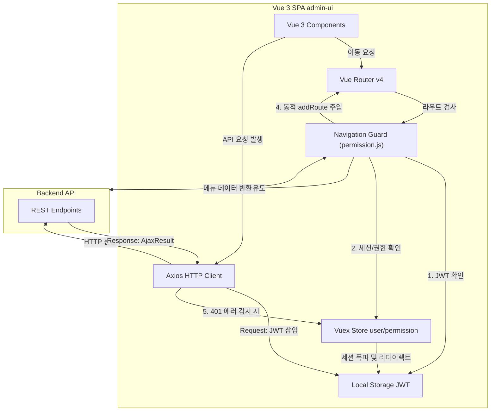

# admin-ui (L/T Framework v3 백오피스 프론트엔드)

`admin-ui`는 **values-play 프레임워크 v3** 에코시스템의 관리자용 SPA(Single Page Application) **프론트엔드 웹 어플리케이션**입니다. (애플리케이션 타이틀: **"Global OMS"**)

## 1. 개요 및 스펙
- **위치**: `/Users/hongtaegi/project/values-play/framework/admin-front/v3/admin-ui`
- **핵심 기술 스택**: 
  - Framework: Vue 3 (Composition API / SFC)
  - UI Library: Element Plus (2.9.11)
  - Build Tool: Vite 7
  - Language: TypeScript (~5.8.3)
  - State Management: **Vuex v4.0.2** (주의: Pinia가 아니며 레거시와의 호환성 및 안정성을 위해 Vuex 4 구조를 고수함)
- **로컬 실행 및 빌드 스크립트**:
  - 로컬 개발 서버 기동: `npm run local` (로컬 개발 서버 포트: `1040`)
  - 개발 빌드: `npm run dev`
  - 기타 환경별 빌드 스크립트: `build:prod`, `build:tmp`, `build:pq`, `build:stage`, `build:dev`, `build:local`

---

## 2. 주요 폴더 구조 및 역할
`src/` 디렉터리는 역할별로 고도로 모듈화되어 구성되어 있습니다.

```text
src/
├── api/                # Axios 기반 백엔드 엔드포인트 호출 모듈 (user.js, menu.js 등)
├── assets/             # 글로벌 SCSS 스타일시트, 폰트 및 이미지 에셋
├── components/         # 전역 공통 재사용 Vue 컴포넌트 (페이징, 브레드크럼 등)
├── composables/        # 리액티브 상태 및 반복 비즈니스 로직 재사용을 위한 Custom Hooks
├── directive/          # 커스텀 디렉티브 (버튼 레벨 권한 검증용 v-hasPermi 등)
├── i18n/               # 다국어(i18n) 설정 및 초기화 스크립트
├── layout/             # 대시보드 사이드바, 네비바, 태그뷰 등 기본 프레임 구조 정의
├── locales/            # 다국어 번역 리소스 파일 (ko.json, en.json)
├── plugins/            # 외부 플러그인 설정 (Element Plus 플러그인 등)
├── router/             # Vue Router 경로 정의 및 가드 설정
├── store/              # Vuex v4 전역 상태 관리 모듈 (User 세션, 테마 상태 등)
├── utils/              # 포맷터, 토큰 제어, 암호화 유틸리티
├── views/              # 도메인별 개별 화면 Page 컴포넌트 (사용자, 메뉴, 역할 등)
├── App.vue             # 최상위 Root 컴포넌트
├── main.js             # 애플리케이션 진입점 및 Vue 인스턴스 초기화 스크립트
├── permission.js       # 라우터 Guard 및 세션 유효성 인증 제어 핵심 파일
└── settings.js         # 글로벌 애플리케이션 속성 설정
```

---

## 3. 런타임 통제 및 보안 메커니즘
애플리케이션 구동 시 사용자의 상태를 식별하고, 비인가 접근을 제어하며, 공통 네트워크 환경을 보호하기 위해 3가지 계층의 제어 흐름이 연동됩니다.



### 3.1 내비게이션 라우터 가드 (`permission.js`)
- 사용자가 라우팅을 시도할 때 `Vue Router`가 이를 캡처하여 검사 수행.
- 브라우저의 `localStorage`에서 JWT 토큰을 판독.
  - 토큰이 존재하지만 Vuex 스토어에 사용자 세션 정보 및 메뉴 권한 목록이 비어있다면, 백엔드의 `/getRouters` API를 비동기 호출.
  - 응답받은 메뉴 구조를 Dynamic Route로 생성하여 `router.addRoute()`로 런타임에 삽입하고 사이드바 메뉴 트리를 reactive하게 동기화.
  - 만약 토큰이 없다면 화이트리스트(로그인 페이지 등)를 제외하고 무조건 로그인 화면으로 강제 유도.

### 3.2 Axios Interceptors
- **Request Interceptor**:
  - 서버로 나가는 모든 HTTP 요청을 가로채서 `localStorage`의 JWT 토큰을 꺼내 `Authorization: Bearer <token>` 헤더로 공통 삽입함.
  - 또한 다국어 지원을 위해 현재 선택된 로케일 헤더를 함께 실어 보냄.
- **Response Interceptor**:
  - 백엔드로부터 온 JSON 응답(`AjaxResult`) 객체를 수신하고 오류 여부를 모니터링.
  - **401 Unauthorized (`code == 401`) 감지**: 사용자의 로그인 토큰이 만료되었거나 임의 조작된 경우로 판단하여, 즉시 Vuex 내의 전역 사용자 상태 및 `localStorage`의 토큰 정보를 소거(폭파)하고 `/login` 페이지로 리다이렉트 유도.
  - **기타 서버 에러 (`code == 500` 등)**: Element Plus의 전역 토스트 팝업(`ElMessage.error`)을 발생시켜 사용자에게 에러 상태를 시각적으로 전파함.
