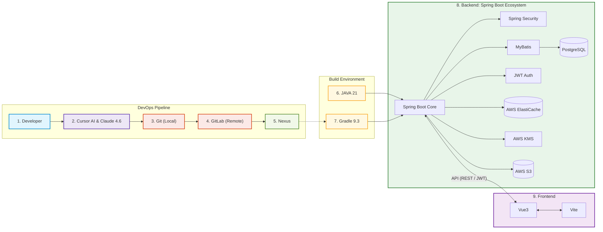

```mermaid
graph LR

    %% 스타일 클래스 정의

    classDef dev fill:#e1f5fe,stroke:#0288d1,stroke-width:2px;

    classDef ai fill:#ede7f6,stroke:#5e35b1,stroke-width:2px;

    classDef git fill:#fbe9e7,stroke:#d84315,stroke-width:2px;

    classDef infra fill:#f1f8e9,stroke:#558b2f,stroke-width:2px;

    classDef build fill:#fff8e1,stroke:#f9a825,stroke-width:2px;

    classDef backend fill:#e8f5e9,stroke:#2e7d32,stroke-width:2px;

    classDef frontend fill:#f3e5f5,stroke:#6a1b9a,stroke-width:2px;

  

    %% 1~5 단계: DevOps 파이프라인

    subgraph Pipeline ["DevOps Pipeline"]

        A["1. Developer"]:::dev

        B["2. Cursor AI & Claude 4.6"]:::ai

        C["3. Git (Local)"]:::git

        D["4. GitLab (Remote)"]:::git

        E["5. Nexus"]:::infra

    end

  

    %% 6~7 단계: 빌드 도구

    subgraph BuildEnv ["Build Environment"]

        F["6. JAVA 21"]:::build

        G["7. Gradle 9.3"]:::build

    end

  

    %% 8단계: 백엔드 스택

    subgraph BackendStack ["8. Backend: Spring Boot Ecosystem"]

        SB["Spring Boot Core"]

        SS["Spring Security"]

        MB["MyBatis"]

        DB[("PostgreSQL")]

        JWT["JWT Auth"]

        EC[("AWS ElastiCache")]

        KMS["AWS KMS"]

        S3[("AWS S3")]

    end

    class BackendStack backend;

  

    %% 9단계: 프론트엔드 스택

    subgraph FrontendStack ["9. Frontend"]

        VUE["Vue3"]

        VITE["Vite"]

    end

    class FrontendStack frontend;

  

    %% --- 데이터 및 프로세스 흐름 연결 ---

    %% 개발 및 형상관리 흐름

    A --> B

    B --> C

    C --> D

    D --> E

  

    %% 빌드 및 백엔드 연결

    E -.-> G

    F --> SB

    G --> SB

  

    %% 백엔드 내부 아키텍처 흐름

    SB --> SS

    SB --> MB

    MB --> DB

    SB --> JWT

    SB --> EC

    SB --> KMS

    SB --> S3

  

    %% 프론트엔드 연결

    VUE <--> VITE

    SB <-->|"API (REST / JWT)"| VUE
```
