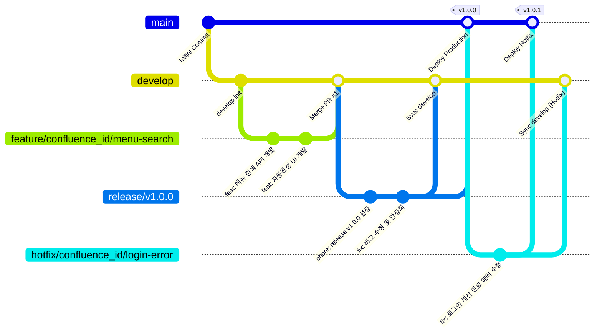

차세대 프로젝트의 소스 코드 형상 관리 및 배포 안정성을 확보하기 위한 **Git Branch 전략**을 정의합니다. 엔터프라이즈 환경에서 검증된 **Git Flow** 모델을 기반으로 하되, 지속적 통합/배포(CI/CD) 효율성을 극대화할 수 있도록 간소화된 표준 가이드를 제시합니다.

---

# 1. Git Branch 워크플로우



---

# 2. 주요 브랜치 정의 및 역할

| 브랜치 분류      | 명명 규칙 (Naming Convention)                | 설명 / 역할                                                                                                       | 생명 주기           | 대상 서버             |
| :---------- | :--------------------------------------- | :------------------------------------------------------------------------------------------------------------ | :-------------- | :---------------- |
| **main**    | `main`                                   | 운영(Production) 환경에 배포되는 가장 안정적인 브랜치입니다. 엄격한 테스트를 거친 릴리스 버전만 병합됩니다.                                            | 영구적             | 운영 (Production)   |
| **develop** | `develop`                                | 다음 출시 버전을 위해 개발된 기능들이 통합되는 브랜치입니다. 개발 서버(Dev)의 자동 배포 대상이 됩니다.                                                 | 영구적             | 개발 (Development)  |
| **feature** | `feature/{confluence_id}/{feature-name}` | 신규 기능 개발 또는 버그 수정을 개별적으로 진행하는 개발용 브랜치입니다. `develop`에서 분기하며, 개발 완료 후 Pull Request(PR)를 통해 `develop`으로 병합됩니다.   | 임시 (병합 후 삭제)    | 로컬 / 개발           |
| **release** | `release/v{version}`                     | 배포 및 검증(QA)을 준비하기 위한 브랜치입니다. `develop`에서 분기하며, 스테이징(Staging) 환경에 배포하여 테스트를 거친 후 `main`과 `develop`으로 최종 병합됩니다. | 임시 (배포 완료 후 삭제) | 스테이징 (Staging/QA) |
| **hotfix**  | `hotfix/{confluence_id}/{hotfix-name}`   | 운영 서버 배포 후 발생한 긴급 장애/버그를 즉시 패치하기 위한 브랜치입니다. `main`에서 분기하며, 수정 완료 후 `main`과 `develop` 모두에 각각 반영합니다.            | 임시 (패치 완료 후 삭제) | 운영 / 개발           |

---

# 3. 개발 및 병합 프로세스 (Step-by-Step)

## Step 1. 기능 개발 시작 (`feature`)
* 개발자는 `develop` 브랜치를 최신화한 후 개별 기능 브랜치를 생성합니다.
  ```bash
  git checkout develop
  git pull origin develop
  git checkout -b feature/confluence_id/menu-autocomplete
  ```

## Step 2. 로컬 개발 및 커밋
* [개발 표준 가이드](./2.%20개발%20표준%20가이드/2.%20frontend/개발%20표준%20가이드.md)의 Commit Message 표준을 준수하여 로컬 개발을 진행합니다.
  ```bash
  git commit -m "feat: 메뉴 검색 키워드 하이라이트 기능 구현"
  ```

## Step 3. 원격 Push 및 Pull Request (PR) 생성
* 원격 저장소에 브랜치를 Push한 후, GitLab/GitHub에서 `develop` 브랜치를 대상으로 Pull Request를 작성합니다.
  ```bash
  git push origin feature/confluence_id/menu-autocomplete
  ```
* **동료 리뷰(Code Review)** 와 빌드/테스트 자동 검증(CI) 통과 후 Merge가 승인됩니다.

## Step 4. 병합 (Merge) 및 브랜치 삭제
* `develop` 브랜치 병합 시 커밋 히스토리를 깔끔하게 유지하기 위해 **Squash and Merge** 방식을 권장합니다. 
* 원격 및 로컬의 임시 feature 브랜치는 병합 즉시 삭제합니다.

---

# 4. 배포 및 검증 프로세스

1. **상시 배포 (개발 환경):** `develop` 브랜치에 코드가 병합될 때마다 CI/CD 파이프라인이 동작하여 개발 서버에 자동으로 배포됩니다.
2. **정기 배포 (스테이징 및 운영):**
   * 기능 테스트가 완료되면 `develop`에서 `release/vX.Y.Z` 브랜치를 분기하여 스테이징 서버에 배포하고 QA를 진행합니다.
   * QA 도중 발견된 버그는 `release` 브랜치 내에서 직접 수정 후 커밋합니다.
   * 최종 검증 완료 후, `release` 브랜치를 `main` 브랜치로 병합(Merge Commit 방식)하여 운영 서버에 배포하고 해당 커밋에 **버전 태그(Tag)**를 생성합니다.
   * 수정된 내용은 반드시 `develop` 브랜치에도 역병합(Sync)을 수행합니다.

---

# 5. Commit Message 규칙
협업 및 소스 이력의 가독성을 위해 아래 규칙으로 커밋 로그를 구성합니다.

* **커밋 헤더 형식:** `<type>: <description>`
  * *예시:* `feat: 메뉴 검색 하이라이트 기능 구현`
* **주요 커밋 타입 목록:**
  * `feat`: 새로운 기능 추가
  * `fix`: 버그 수정
  * `docs`: 문서 수정 (예: README.md, 가이드 문서 등)
  * `style`: 코드 포맷팅, 세미콜론 누락 등 (비즈니스 로직 변경이 없는 경우)
  * `refactor`: 코드 리팩토링 (기능 변화는 없음)
  * `chore`: 빌드 설정, 패키지 매니저 설정 변경 등